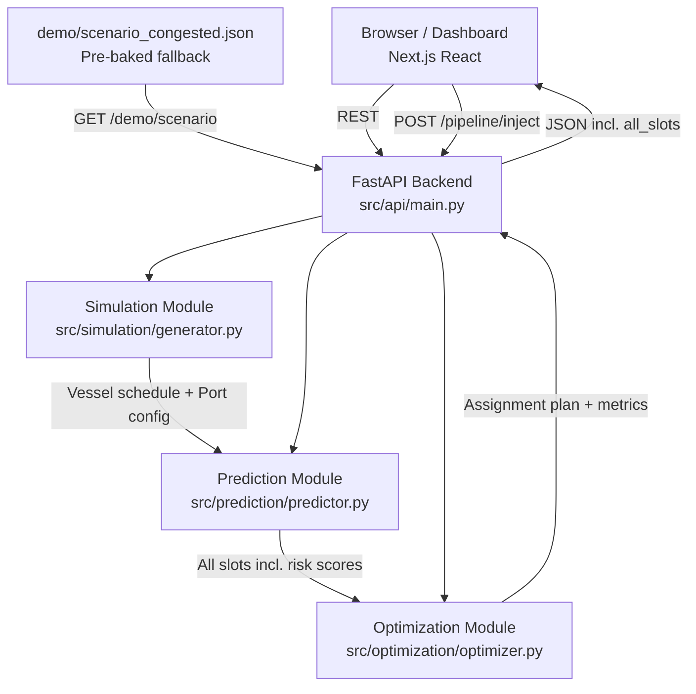

# Architecture — PortPulse

## Pipeline

```
simulate → predict → optimize → visualize
```



## Components

| Component | Technology | Responsibility |
|---|---|---|
| Frontend | Next.js 14 + React 18 + Tailwind CSS | 72h ops plan dashboard, congestion heatmap, metrics panel, vessel injector |
| Backend API | FastAPI + Uvicorn | Orchestrates pipeline, exposes REST endpoints, computes injection diffs |
| Simulation | Python (stdlib only) | Generates synthetic 72h vessel schedule with injectable congestion; `inject_vessel()` / `make_injected_vessel()` for what-if |
| Prediction | Python (stdlib only) | Queue-length forecasting; risk score per berth per 2h slot → `CongestionSlot[]`; per-berth independent busy tracker |
| Optimization | Python (stdlib only) | Greedy berth/crane assignment; before/after wait-time metrics; reroute threshold filter |
| Shared Types | src/shared/models.py | Single source of truth for `Vessel`, `Berth`, `Crane` dataclasses and enums |

## Data Flow

1. **POST /simulate** — Generates vessel arrivals (ETA, class, cargo, priority) and port state (8 berths, 20 cranes). Optional: inject a burst at a chosen hour + take a berth offline for maintenance.

2. **GET /predict** — Scores each berth × 2-hour time slot over the 72h horizon with a 0–1 risk score. Uses a sigmoid centred at `demand_ratio=0.35` — `max(0, tanh(4*(demand_ratio - 0.35)))` — with per-berth carryover pressure (≤+0.10) that only fires when new arrivals encounter an already-occupied berth. Slots ≥0.65 are flagged **HIGH**; ≥0.85 **CRITICAL**. Pass `?include_all_slots=true` to get all 288 slots (required for full heatmap colour spread).

3. **POST /optimize** — Greedy assignment: sort by priority/ETA, pick the earliest-available compatible berth, reroute away from CRITICAL slots if a non-critical alternative exists within 10% extra wait, allocate cranes by throughput. Returns before/after average wait comparison.

4. **POST /pipeline** — Single call that runs all three steps and returns the full result payload including `all_slots` for the heatmap.

5. **POST /pipeline/inject** — What-If injection endpoint. Accepts a vessel description (`vessel_class`, `eta_hour`, `priority`, `cargo_volume_teu`), runs the full pipeline twice (before/after injection), and returns a `diff` containing:
   - `slot_tier_changes` — berth/slot pairs where the risk tier changed (OK→HIGH, HIGH→CRITICAL, etc.)
   - `avg_wait_delta_hours` — net change in average port wait time
   - `rerouted_vessels` — existing vessels moved to a different berth, **filtered to `abs(wait_delta) ≥ 2h`** to suppress trivial greedy re-sort artefacts
   - `injected_vessel_assignment` — which berth and wait time the new vessel received

6. **GET /demo/scenario** — Returns the pre-baked `demo/scenario_congested.json` (generated once and cached on first call).

## Heatmap Rendering

The congestion heatmap (`CongestionHeatmap.tsx`) receives `all_slots` (288 records = 8 berths × 36 two-hour slots). It aggregates by 6-hour buckets (12 columns) taking the **maximum risk score** per berth/bucket cell. Cells are coloured on a continuous gradient:

| Risk score | Colour | Meaning |
|---|---|---|
| `0.0` | Stone grey `#E8E5DE` | No arrivals in this window |
| `0.0 – 0.40` | Forest green | Low demand — port has ample capacity |
| `0.40 – 0.65` | Amber | Moderate demand — worth monitoring |
| `0.65 – 0.85` | Terracotta | HIGH — proactive rerouting recommended |
| `0.85 – 1.0` | Crimson | CRITICAL — immediate action required |

## Scalability Notes

This is a hackathon prototype using in-memory state and flat-file caching.
v2 upgrade paths:

- Replace greedy optimizer with OR-Tools CP-SAT for globally optimal assignments.
- Add persistent storage (PostgreSQL) for multi-session history.
- Stream real AIS vessel data instead of simulation.
- Horizontally scale the stateless FastAPI backend behind a load balancer.
- Add an ML layer (XGBoost on historical throughput data) to replace the rule-based predictor.
