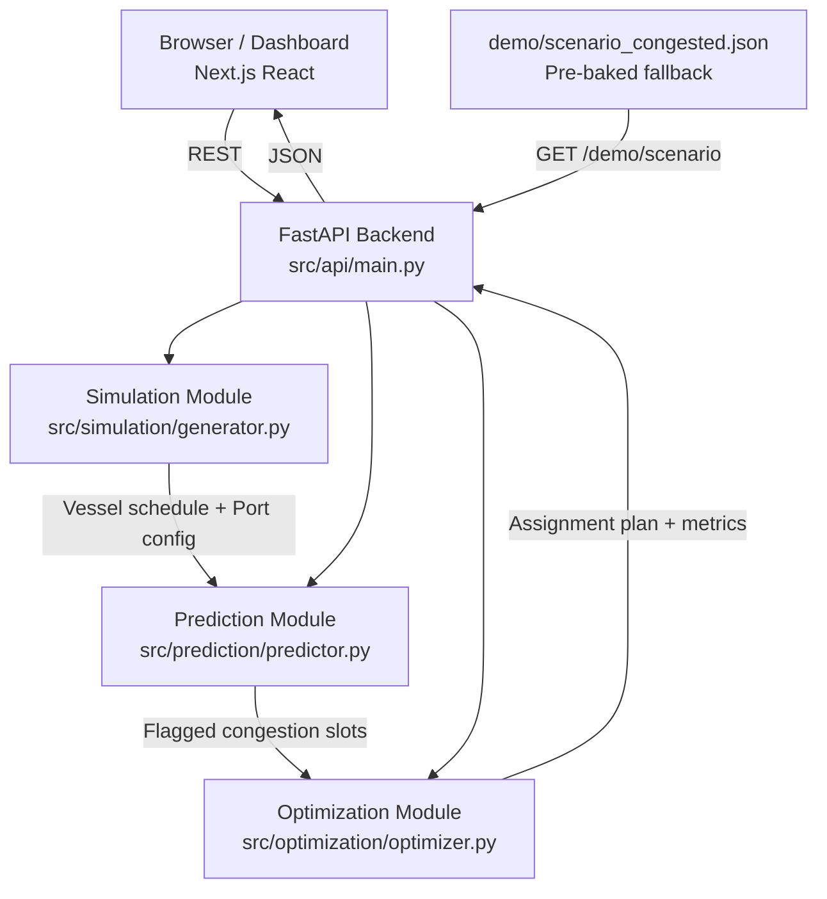

# Architecture — PortPulse

## Pipeline

```
simulate → predict → optimize → visualize
```



## Components

| Component | Technology | Responsibility |
|---|---|---|
| Frontend | Next.js 14 + React 18 + Recharts | 72h ops plan dashboard, congestion heatmap, metrics panel |
| Backend API | FastAPI + Uvicorn | Orchestrates pipeline, exposes REST endpoints |
| Simulation | Python (stdlib only) | Generates synthetic 72h vessel schedule with injectable congestion |
| Prediction | Python (stdlib only) | Queue-length forecasting; risk score per berth per 2h slot |
| Optimization | Python (stdlib only) | Greedy berth/crane assignment; before/after wait-time metrics |
| Shared Types | src/shared/models.py | Single source of truth for Vessel, Berth, Crane dataclasses |

## Data Flow

1. **POST /simulate** — Generates vessel arrivals (ETA, class, cargo, priority) and port state (8 berths, 20 cranes). Optional: inject a burst at hour 24 + take B05 offline.
2. **GET /predict** — Scores each berth × time-slot (2h granularity) with a risk score 0→1. Slots ≥ 0.65 are flagged HIGH, ≥ 0.85 CRITICAL.
3. **POST /optimize** — Greedy assignment: sort vessels by priority/ETA, reroute away from flagged slots, allocate cranes to minimise service time. Outputs before/after average wait.
4. **POST /pipeline** — Single call that runs all three steps and returns the full result payload for the dashboard.
5. **GET /demo/scenario** — Returns the pre-baked `demo/scenario_congested.json` (generated once and cached).

## Scalability Notes

This is a hackathon prototype using in-memory state and flat-file caching.
v2 upgrade paths:
- Replace greedy optimizer with OR-Tools CP-SAT for globally optimal assignments.
- Add persistent storage (PostgreSQL) for multi-session history.
- Stream real AIS vessel data instead of simulation.
- Horizontally scale the stateless FastAPI backend behind a load balancer.
